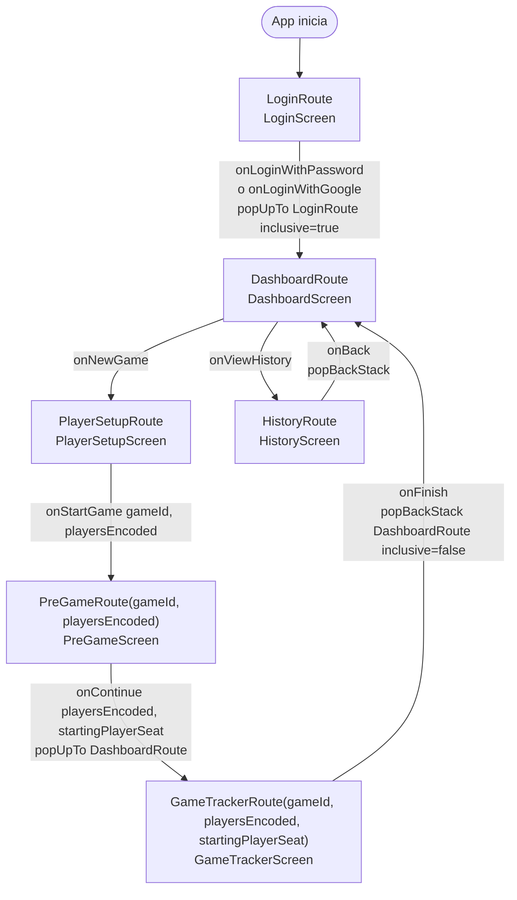

# Diagrama: flujo de navegación de Android

Fuente de verdad: `android/app/src/main/java/com/commandercompanion/
presentation/navigation/AppNavigation.kt` (grafo real del `NavHost`) y
`Routes.kt` (definición de cada ruta y sus argumentos, con
`kotlinx.serialization` vía `ExperimentalSafeArgsApi`/`toRoute`).

## Grafo de navegación

## Detalle de cada ruta

| Ruta | Tipo | Argumentos | Pantalla | Notas |
|---|---|---|---|---|
| `LoginRoute` | `object` | ninguno | `LoginScreen` | `startDestination` del `NavHost` |
| `DashboardRoute` | `object` | ninguno | `DashboardScreen` | hub central; se llega acá tras login y tras terminar cualquier partida |
| `PlayerSetupRoute` | `object` | ninguno | `PlayerSetupScreen` | genera el `gameId` (UUID local) y codifica los jugadores antes de navegar |
| `PreGameRoute` | `data class` | `gameId: String`, `playersEncoded: String` | `PreGameScreen` | agrega sorteo de turno + mulligans a los `PlayerConfig` recibidos |
| `GameTrackerRoute` | `data class` | `gameId: String`, `playersEncoded: String`, `startingPlayerSeat: Int` | `GameTrackerScreen` | consumido por `GameViewModel` vía `SavedStateHandle` |
| `HistoryRoute` | `object` | ninguno | `HistoryScreen` | lee de Room, no depende de ningún argumento de ruta |

`playersEncoded` es un string producido por `PlayerConfigCodec`
(`encodePlayerConfigs`/`decodePlayerConfigs`) con formato
`name|colorKey|mulligans` por jugador — decodificación retrocompatible con
encodes de 2 campos (sin `mulligans`) para no romper si algún caller viejo
todavía no manda ese tercer campo.

## Reglas de back stack explícitas en el código

- **Login → Dashboard**: `popUpTo(LoginRoute) { inclusive = true }` — una
  vez "dentro" de la app, el botón atrás no debe poder volver al login.
- **PreGame → GameTracker**: `popUpTo(DashboardRoute)` (sin `inclusive`) —
  al llegar al tracker, tanto `PlayerSetupRoute` como `PreGameRoute`
  desaparecen del back stack, pero `DashboardRoute` se conserva como tope.
  Efecto práctico: desde `GameTrackerScreen`, el botón atrás del sistema
  volvería directo a `DashboardScreen`, no a repetir el setup.
- **GameTracker → Dashboard** (al finalizar): `popBackStack(DashboardRoute,
  inclusive = false)` — vuelve al dashboard sin sacarlo del stack.
- **History → Dashboard**: `popBackStack()` simple (no hay argumentos que
  limpiar).

## Qué falta para el flujo objetivo (Stage 4/5)

Este grafo es la **estructura** de navegación, ya considerada "definida"
como decisión de diseño (`TASKS.md`, Stage 4: "Flujo de navegación de la app
definido"). Lo que falta para que sea el flujo real de producto, no solo el
esqueleto:

- `LoginRoute` no autentica — ambos callbacks (`onLoginWithPassword`,
  `onLoginWithGoogle`) navegan directo a `DashboardRoute` sin llamar a
  `POST /auth/login` ni a Credential Manager/Google Identity Services.
- No hay ninguna ruta ni pantalla que hable con `games`/`game-actions`/
  `statistics` del backend — todo el sub-grafo `PlayerSetupRoute →
  PreGameRoute → GameTrackerRoute` opera 100% en local (Room), como se
  detalla en `docs/ux/casos-de-uso.md`.
- No existe todavía una ruta de "unirse a una partida existente" (join por
  código/invitación) ni de "estadísticas" — ambas son funcionalidad de
  backend ya implementada sin UI Android correspondiente.
