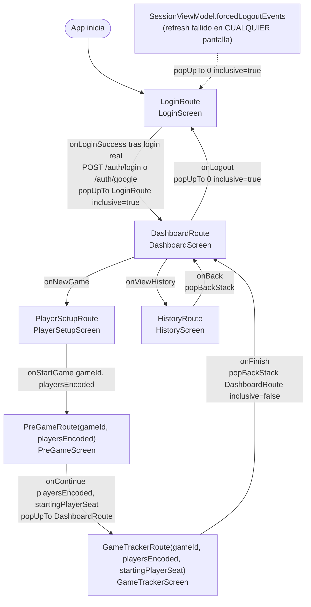

# Diagrama: flujo de navegación de Android

Fuente de verdad: `android/app/src/main/java/com/commandercompanion/
presentation/navigation/AppNavigation.kt` (grafo real del `NavHost`) y
`Routes.kt` (definición de cada ruta y sus argumentos, con
`kotlinx.serialization` vía `ExperimentalSafeArgsApi`/`toRoute`).

## Grafo de navegación

## Detalle de cada ruta

| Ruta | Tipo | Argumentos | Pantalla | Notas |
|---|---|---|---|---|
| `LoginRoute` | `object` | ninguno | `LoginScreen` | `startDestination` del `NavHost`; login real (password o Google) vía `LoginViewModel`, un solo callback `onLoginSuccess` (no uno por método) |
| `DashboardRoute` | `object` | ninguno | `DashboardScreen` | hub central; se llega acá tras login y tras terminar cualquier partida; expone `onLogout` (`popUpTo(0) { inclusive = true }`, vuelve a `LoginRoute` limpiando todo el back stack) |
| `PlayerSetupRoute` | `object` | ninguno | `PlayerSetupScreen` | genera el `gameId` (UUID local) y codifica los jugadores antes de navegar; modo Grupo (2026-07-28) también resuelve un `playgroupId`, ver `docs/ux/wireframes.md` |
| `PreGameRoute` | `data class` | `gameId: String`, `playersEncoded: String`, `playgroupId: String? = null` | `PreGameScreen` | agrega sorteo de turno + mulligans a los `PlayerConfig` recibidos; `playgroupId` (2026-07-28) solo viaja de paso hacia `GameTrackerRoute`, esta pantalla no lo usa |
| `GameTrackerRoute` | `data class` | `gameId: String`, `playersEncoded: String`, `startingPlayerSeat: Int`, `playgroupId: String? = null` | `GameTrackerScreen` | consumido por `GameViewModel` vía `SavedStateHandle`; `null` = partida Casual (`GameRepository.bootstrapRemoteGame` no crea nada remoto si además ningún asiento tiene `assignedUserId`) |
| `HistoryRoute` | `object` | ninguno | `HistoryScreen` | lee de Room, no depende de ningún argumento de ruta |

`playersEncoded` es un string producido por `PlayerConfigCodec`
(`encodePlayerConfigs`/`decodePlayerConfigs`) con formato
`name|colorKey|mulligans|assignedUserId|assignedUsername|deckId` por jugador
(los últimos tres campos, agregados 2026-07-28 para el modo Grupo, van vacíos
en modo Casual) — decodificación retrocompatible con encodes de menos campos
(hasta el formato original de 2, sin `mulligans`) para no romper si algún
caller viejo todavía no los manda.

## Reglas de back stack explícitas en el código

- **Login → Dashboard**: `popUpTo(LoginRoute) { inclusive = true }` — una
  vez "dentro" de la app, el botón atrás no debe poder volver al login.
- **PreGame → GameTracker**: `popUpTo(DashboardRoute)` (sin `inclusive`) —
  al llegar al tracker, tanto `PlayerSetupRoute` como `PreGameRoute`
  desaparecen del back stack, pero `DashboardRoute` se conserva como tope.
  Efecto práctico: desde `GameTrackerScreen`, el botón atrás del sistema
  volvería directo a `DashboardScreen`, no a repetir el setup.
- **GameTracker → Dashboard** (al finalizar): `popBackStack(DashboardRoute,
  inclusive = false)` — vuelve al dashboard sin sacarlo del stack.
- **History → Dashboard**: `popBackStack()` simple (no hay argumentos que
  limpiar).

## Qué falta para el flujo objetivo (Stage 4/5)

Este grafo es la **estructura** de navegación, ya considerada "definida"
como decisión de diseño (`TASKS.md`, Stage 4: "Flujo de navegación de la app
definido"). **Actualizado 2026-07-27:** `LoginRoute` ya autentica de verdad
(ver tabla arriba) y el sub-grafo `PlayerSetupRoute → PreGameRoute →
GameTrackerRoute` ya no es 100% local — `GameTrackerScreen` espeja
best-effort el asiento del usuario autenticado contra `games`/`game-actions`
reales (`GameRepository.bootstrapRemoteGame`/`recordLifeChange`/`finishGame`,
ver `docs/ux/casos-de-uso.md`), aunque sigue sin haber ninguna ruta/pantalla
*dedicada* a esa integración (no hay indicador visual más allá del
`RemoteSyncBanner` en el propio tracker, ver `docs/ux/wireframes.md`). Lo
que falta realmente:

- Ruta de "unirse a una partida existente" (join por código/invitación desde
  otro dispositivo) — hoy el único `join` real es automático, del asiento 1
  contra la partida que él mismo crea.
- Ruta de selección de deck — `bootstrapRemoteGame` usa
  `DeckRepository.firstDeckId()` (el primero de la lista) en vez de dejar
  elegir.
- Ruta de "estadísticas" — `/statistics/*` ya está implementado en el
  backend y ya tiene los tres métodos en `CommanderApi.kt`, pero no hay
  pantalla ni repositorio en Android que los consuma.
- Cliente WebSocket (Stage 6) para ver en vivo lo que hacen *otros*
  dispositivos sentados en la misma partida — el espejo de hoy es solo REST
  unidireccional (Android → backend), no hay suscripción de entrada.
