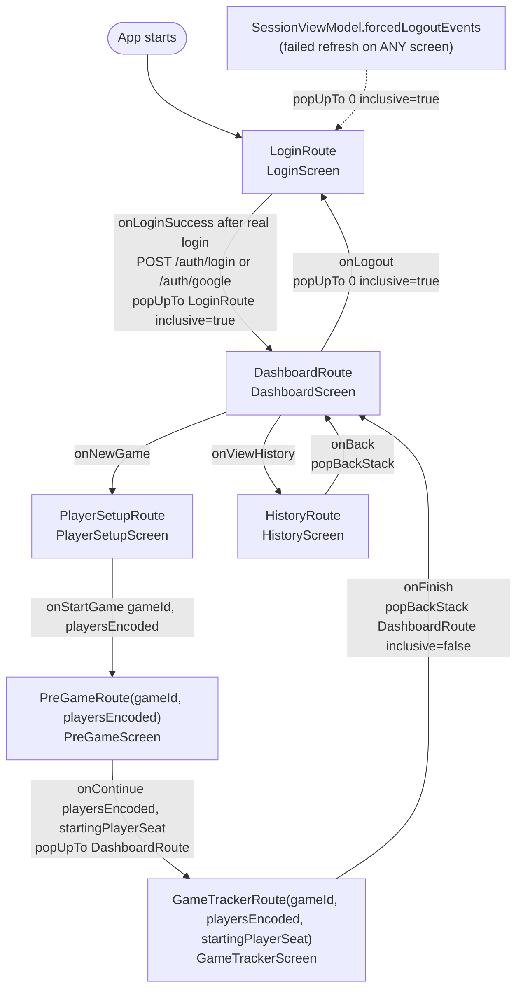

# Diagram: Android navigation flow

Source of truth: `android/app/src/main/java/com/commandercompanion/
presentation/navigation/AppNavigation.kt` (the real `NavHost` graph) and
`Routes.kt` (definition of each route and its arguments, with
`kotlinx.serialization` via `toRoute`). Type-safe navigation is stable as of
`navigation-compose 2.9.8` — no `@OptIn` needed anymore (it was still
experimental, gated by `ExperimentalSafeArgsApi`, at the time this diagram
was first written against `2.8.0-alpha07`).

## Navigation graph

## Detail of each route

| Route | Type | Arguments | Screen | Notes |
|---|---|---|---|---|
| `LoginRoute` | `object` | none | `LoginScreen` | `startDestination` of the `NavHost`; real login (password or Google) via `LoginViewModel`, a single `onLoginSuccess` callback (not one per method) |
| `DashboardRoute` | `object` | none | `DashboardScreen` | central hub; reached after login and after finishing any game; exposes `onLogout` (`popUpTo(0) { inclusive = true }`, returns to `LoginRoute` clearing the whole back stack) |
| `PlayerSetupRoute` | `object` | none | `PlayerSetupScreen` | generates the `gameId` (local UUID) and encodes the players before navigating; Group mode (2026-07-28) also resolves a `playgroupId`, see `docs/ux/wireframes.md` |
| `PreGameRoute` | `data class` | `gameId: String`, `playersEncoded: String`, `playgroupId: String? = null` | `PreGameScreen` | adds turn draw + mulligans to the received `PlayerConfig` values; `playgroupId` (2026-07-28) only passes through on the way to `GameTrackerRoute`, this screen doesn't use it |
| `GameTrackerRoute` | `data class` | `gameId: String`, `playersEncoded: String`, `startingPlayerSeat: Int`, `playgroupId: String? = null` | `GameTrackerScreen` | consumed by `GameViewModel` via `SavedStateHandle`; `null` = Casual game (`GameRepository.bootstrapRemoteGame` creates nothing remote if, additionally, no seat has an `assignedUserId`) |
| `HistoryRoute` | `object` | none | `HistoryScreen` | reads from Room, does not depend on any route argument |

`playersEncoded` is a string produced by `PlayerConfigCodec`
(`encodePlayerConfigs`/`decodePlayerConfigs`) with the format
`name|colorKey|mulligans|assignedUserId|assignedUsername|deckId` per player
(the last three fields, added 2026-07-28 for Group mode, are left empty in
Casual mode) — decoding is backward-compatible with encodes that have fewer
fields (down to the original 2-field format, without `mulligans`) so as not
to break if some old caller still doesn't send them.

## Back stack rules explicit in the code

- **Login → Dashboard**: `popUpTo(LoginRoute) { inclusive = true }` — once
  "inside" the app, the back button must not be able to return to login.
- **PreGame → GameTracker**: `popUpTo(DashboardRoute)` (without
  `inclusive`) — on reaching the tracker, both `PlayerSetupRoute` and
  `PreGameRoute` disappear from the back stack, but `DashboardRoute` is
  kept as the base. Practical effect: from `GameTrackerScreen`, the
  system's back button would go straight back to `DashboardScreen`, not
  repeat the setup.
- **GameTracker → Dashboard** (on finishing): `popBackStack(DashboardRoute,
  inclusive = false)` — returns to the dashboard without removing it from
  the stack.
- **History → Dashboard**: simple `popBackStack()` (no arguments to
  clear).

## What's missing for the target flow (Stage 4/5)

This graph is the navigation **structure**, already considered "defined"
as a design decision (`TASKS.md`, Stage 4: "App navigation flow defined").
**Updated 2026-07-27:** `LoginRoute` already authenticates for real (see
table above) and the `PlayerSetupRoute → PreGameRoute → GameTrackerRoute`
sub-graph is no longer 100% local — `GameTrackerScreen` mirrors
best-effort the authenticated user's seat against real
`games`/`game-actions`
(`GameRepository.bootstrapRemoteGame`/`recordLifeChange`/`finishGame`, see
`docs/ux/use-cases.md`), although there is still no route/screen
*dedicated* to that integration (no visual indicator beyond the
`RemoteSyncBanner` in the tracker itself, see `docs/ux/wireframes.md`).
What's actually still missing:

- Route for "joining an existing game" (join by code/invitation from
  another device) — today the only real `join` is automatic, for seat 1
  against the game it creates itself.
- Deck selection route — `bootstrapRemoteGame` uses
  `DeckRepository.firstDeckId()` (the first one in the list) instead of
  letting the user choose.
- "Statistics" route — `/statistics/*` is already implemented in the
  backend and already has all three methods in `CommanderApi.kt`, but
  there is no screen or repository in Android that consumes them.
- WebSocket client (Stage 6) to see live what *other* devices seated in
  the same game are doing — today's mirror is REST-only, one-way (Android
  → backend), with no inbound subscription.
