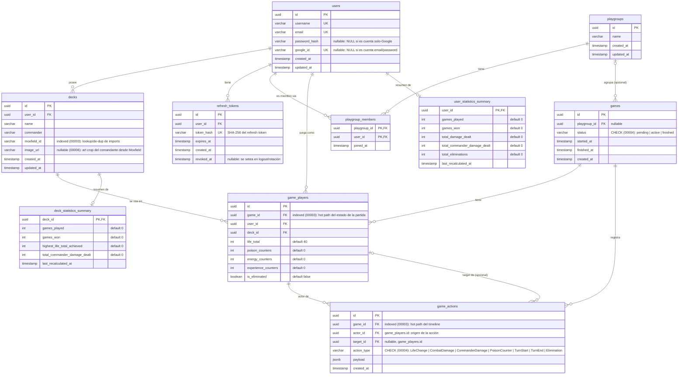

# Diagrama ER — Commander Companion

Diagrama entidad-relación generado a partir del esquema real (`docs/database/schema.dbml`,
compilado a SQL en `backend/migrations/00001_initial_schema.sql` +
`00002_auth.sql` + `00003_indices.sql` + `00004_status_constraints.sql` +
`00005_pagination_indices.sql` + `00006_deck_image_url.sql`).
Mantener sincronizado con el DBML cada vez que cambie el esquema.

## Notas

- `user_statistics_summary` y `deck_statistics_summary` son tablas de resumen
  pre-calculado (1:1 opcional con `users`/`decks`): no existe fila hasta que el
  usuario/deck termina su primera partida (ver `internal/statistics`).
- `game_actions.target_id` es opcional: varias acciones (`TurnStart`,
  `TurnEnd`, o `LifeChange`/`Elimination` sobre uno mismo) no tienen target,
  y el sujeto de la acción es el propio `actor_id`.
- Índices explícitos más allá de las PK (`decks.moxfield_id`,
  `game_actions.game_id`, `game_players.game_id`) y los `CHECK` de
  `games.status` / `game_actions.action_type` se agregaron en
  `backend/migrations/00003_indices.sql` y
  `backend/migrations/00004_status_constraints.sql` respectivamente;
  `00005_pagination_indices.sql` agrega índices compuestos de apoyo al
  paginado keyset de `/decks` y `/games` — ver `docs/roadmap/TASKS.md`
  Stage 2.
- `decks.image_url` (`00006_deck_image_url.sql`) se completa en el import/
  resync de Moxfield (`internal/moxfield/client.go`), a partir del campo
  `main.id` de la respuesta de Moxfield (arma
  `https://assets.moxfield.net/cards/card-{id}-art_crop.jpg`, el mismo art
  crop que Moxfield usa como su propio `og:image`) — no es una URL
  arbitraria del cliente. Ver `docs/api/openapi.yaml` (`Deck.image_url`).
