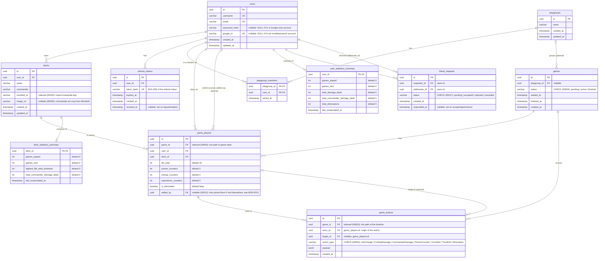

# ER Diagram — Commander Companion

Entity-relationship diagram generated from the real schema
(`docs/database/schema.dbml`, compiled to SQL in
`backend/migrations/00001_initial_schema.sql` through
`00012_game_player_proxy_join.sql`, see the directory for the full
listing). Keep in sync with the DBML whenever the schema changes.

## Notes

- `user_statistics_summary` and `deck_statistics_summary` are pre-computed
  summary tables (optional 1:1 with `users`/`decks`): no row exists until
  the user/deck finishes their first game (see `internal/statistics`).
- `game_actions.target_id` is optional: several actions (`TurnStart`,
  `TurnEnd`, or `LifeChange`/`Elimination` on oneself) have no target, and
  the subject of the action is `actor_id` itself.
- Explicit indexes beyond the PKs (`decks.moxfield_id`,
  `game_actions.game_id`, `game_players.game_id`) and the `CHECK`
  constraints on `games.status` / `game_actions.action_type` were added in
  `backend/migrations/00003_indices.sql` and
  `backend/migrations/00004_status_constraints.sql` respectively;
  `00005_pagination_indices.sql` adds composite indexes supporting keyset
  pagination for `/decks` and `/games` — see `docs/roadmap/TASKS.md`
  Stage 2.
- `decks.image_url` (`00006_deck_image_url.sql`) is populated during
  Moxfield import/resync (`internal/moxfield/client.go`), from the
  `main.id` field of the Moxfield response (it builds
  `https://assets.moxfield.net/cards/card-{id}-art_crop.jpg`, the same art
  crop Moxfield uses as its own `og:image`) — it is not an arbitrary URL
  from the client. See `docs/api/openapi.yaml` (`Deck.image_url`).
- `friend_requests` (`00017_friend_requests.sql`, see ADR-0017) has no
  separate `friends` table: an `accepted` row IS the friendship, resolved to
  "the other user" regardless of which side was `requester_id`. This diagram
  predates the tournaments tables (`00016`) and the async job tables
  (`moxfield_import_jobs`/`deck_resync_jobs`, `00010`/`00013`) — see
  `docs/database/schema.dbml` for the always-current full schema.
