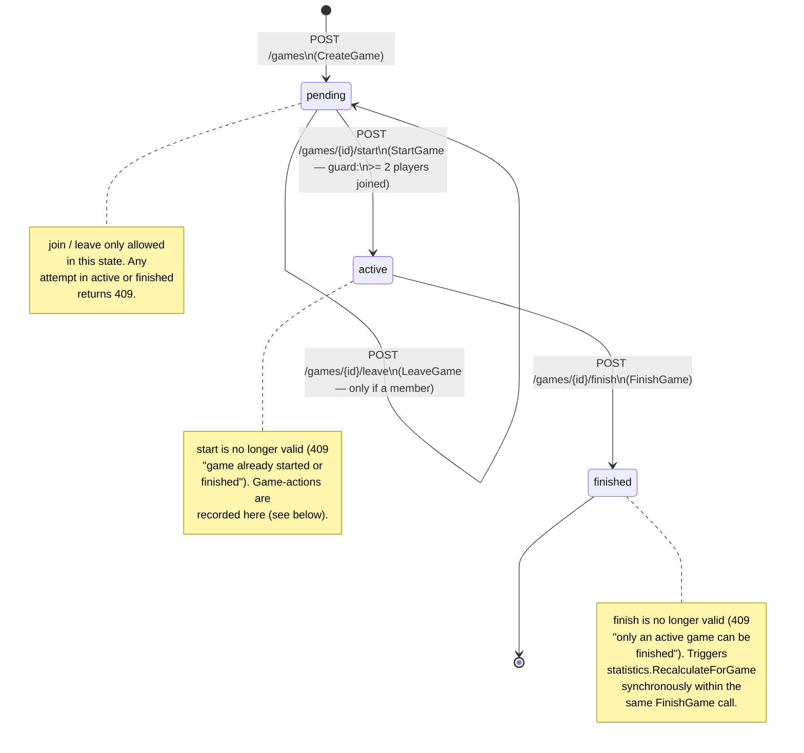
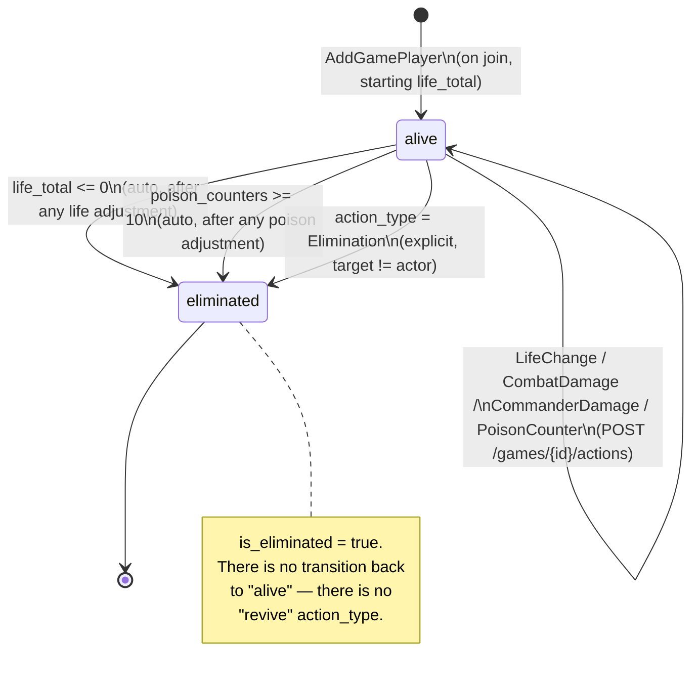

# Diagram: state machine of a game (backend)

Source of truth for behavior: `backend/internal/games/service.go`
(transitions) and `backend/internal/game-actions/service.go` (what can be
done within each state, and the individual player's auto-transitions on
elimination). All invalid transitions return `409 Conflict`; a
non-existent or non-parseable game `id` returns `404`.

## Game states and transitions

### Exact guards (`games/service.go`)

| Transition | Guard | Error if it fails |
|---|---|---|
| `pending → pending` (join) | game is `pending`; `deck_id` exists and belongs to the authenticated user (JWT); user is not already seated in this game | `409` if not `pending`; `404 "deck not found"` if the deck doesn't exist or isn't yours (same message for both cases, so as not to reveal which); `409 "already joined this game"` |
| `pending → pending` (leave) | game is `pending`; user is a current member | `409 "cannot leave a game that already started"` if not `pending`; `404 "not a member of this game"` if not a member |
| `pending → active` (start) | game is `pending`; `len(players) >= minPlayersToStart` (constant = 2) | `409 "game already started or finished"` if not `pending`; `409 "not enough players to start"` if there are < 2 players |
| `active → finished` (finish) | game is `active` | `409 "only an active game can be finished"` in any other state |

`minPlayersToStart = 2` is a constant in the code
(`games/service.go:18`), not configurable via environment variable today.

## Sub-state: actions and player elimination within `active`

While the game is `active`, each player (`game_players`) has their own
lifecycle independent of the game's overall state, governed by
`game-actions/service.go`:

**Important:** `RecordAction` is only accepted if the parent game is
`active` (`409 "game is not active"` in any other state) — regardless of
whether the affected player is already eliminated or not; the schema does
not block recording actions on a player who is already eliminated.

Valid `action_type` values (closed vocabulary, `isValidActionType`):
`LifeChange`, `CombatDamage`, `CommanderDamage`, `PoisonCounter`,
`TurnStart`, `TurnEnd`, `Elimination`. Any other value → `400 "invalid
action_type"`.

## How the winner is determined at finish time

`FinishGame` does not receive an explicit winner. The `active → finished`
transition is unconditional (once the state guard has passed); the winner
is calculated **afterward**, in `statistics.RecalculateForGame` (triggered
within the same `FinishGame` call, via the `StatisticsRecalculator`
interface):

- **Single survivor** (`is_eliminated = false`) among the game's
  `game_players` → that player is credited `games_won +1`.
- **2 or more survivors** (game cut short manually before reaching 1 player
  alive) → no one is credited with the win, but all participants still get
  `games_played +1` counted.

## Known limitations (documented in the code itself)

- `CommanderDamage` today behaves the same as `CombatDamage`: it subtracts
  from aggregate `life_total`, without distinguishing the damage source per
  opponent (real Commander rule: 21 commander damage from a single source
  eliminates). The schema (`game_players`) has no table for damage per
  player-commander pair — it would require a new migration.
- `TurnStart`/`TurnEnd` are log-only markers: `games` has no column for
  "whose turn it currently is", so these actions do not mutate any state,
  they just stay in the timeline (`GET /games/{id}/actions`).
