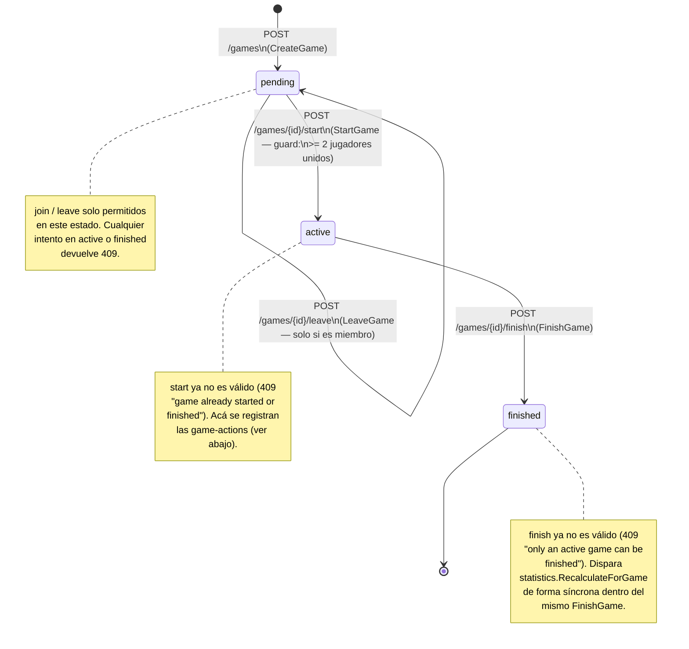

# Diagrama: máquina de estados de una partida (backend)

Fuente de verdad del comportamiento: `backend/internal/games/service.go`
(transiciones) y `backend/internal/game-actions/service.go` (qué se puede
hacer dentro de cada estado, y las auto-transiciones de jugador individual
por eliminación). Todas las transiciones inválidas devuelven `409 Conflict`;
un `id` de partida inexistente o no-parseable devuelve `404`.

## Estados y transiciones de la partida

### Guards exactos (`games/service.go`)

| Transición | Guard | Error si falla |
|---|---|---|
| `pending → pending` (join) | partida en `pending`; `deck_id` existe y pertenece al usuario autenticado (JWT); usuario no está ya sentado en esta partida | `409` si no está `pending`; `404 "deck not found"` si el deck no existe o no es tuyo (mismo mensaje para ambos casos, para no revelar cuál); `409 "already joined this game"` |
| `pending → pending` (leave) | partida en `pending`; usuario es miembro actual | `409 "cannot leave a game that already started"` si no está `pending`; `404 "not a member of this game"` si no es miembro |
| `pending → active` (start) | partida en `pending`; `len(players) >= minPlayersToStart` (constante = 2) | `409 "game already started or finished"` si no está `pending`; `409 "not enough players to start"` si hay < 2 jugadores |
| `active → finished` (finish) | partida en `active` | `409 "only an active game can be finished"` en cualquier otro estado |

`minPlayersToStart = 2` es una constante en el código
(`games/service.go:18`), no configurable por variable de entorno hoy.

## Sub-estado: acciones y eliminación de jugadores dentro de `active`

Mientras la partida está `active`, cada jugador (`game_players`) tiene su
propio ciclo de vida independiente del estado global de la partida,
gobernado por `game-actions/service.go`:

**Importante:** `RecordAction` solo se acepta si la partida-padre está
`active` (`409 "game is not active"` en cualquier otro estado) —
independientemente de si el jugador afectado ya está eliminado o no; el
esquema no bloquea registrar acciones sobre un jugador ya eliminado.

`action_type` válidos (vocabulario cerrado, `isValidActionType`):
`LifeChange`, `CombatDamage`, `CommanderDamage`, `PoisonCounter`,
`TurnStart`, `TurnEnd`, `Elimination`. Cualquier otro valor → `400 "invalid
action_type"`.

## Cómo se determina el ganador al finalizar

`FinishGame` no recibe un ganador explícito. La transición
`active → finished` es incondicional (una vez pasado el guard de estado);
el ganador se calcula **después**, en `statistics.RecalculateForGame`
(disparado dentro del mismo `FinishGame`, vía la interfaz
`StatisticsRecalculator`):

- **Único sobreviviente** (`is_eliminated = false`) entre los
  `game_players` de la partida → se acredita `games_won +1` a ese jugador.
- **2 o más sobrevivientes** (partida cortada a mano antes de llegar a 1
  jugador vivo) → nadie se acredita la victoria, pero a todos los
  participantes se les cuenta `games_played +1` igual.

## Límites conocidos (documentados en el propio código)

- `CommanderDamage` hoy se comporta igual que `CombatDamage`: resta de
  `life_total` agregado, sin distinguir la fuente del daño por oponente
  (regla real de Commander: 21 de daño de comandante de una misma fuente
  elimina). El esquema (`game_players`) no tiene una tabla de daño por par
  jugador-comandante — requeriría una migración nueva.
- `TurnStart`/`TurnEnd` son marcadores de solo-log: `games` no tiene columna
  de "de quién es el turno actual", así que estas acciones no mutan ningún
  estado, solo quedan en el timeline (`GET /games/{id}/actions`).
