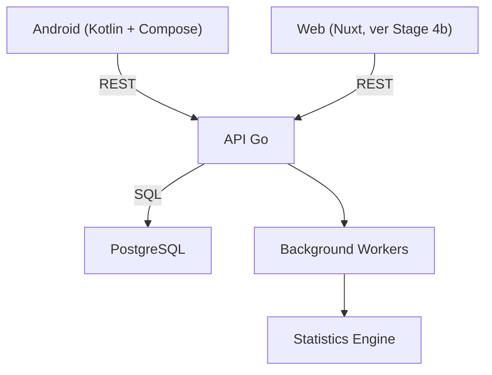
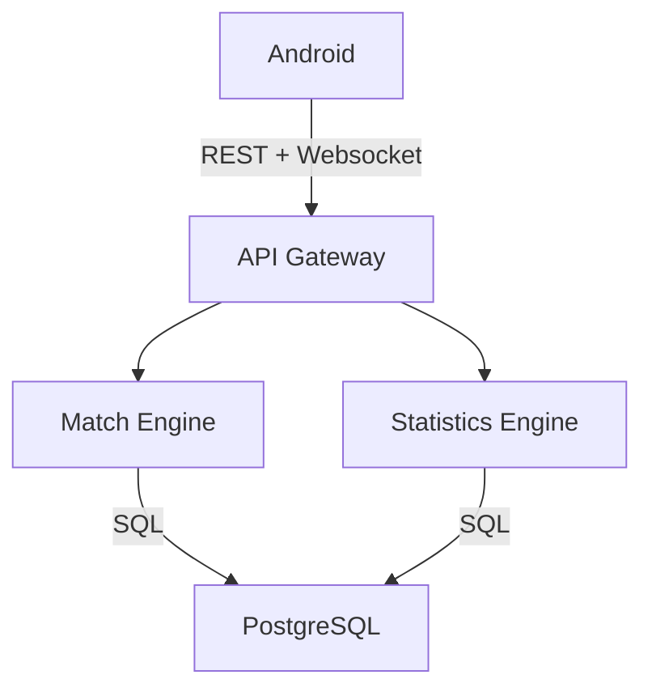

# Commander Companion
## Roadmap de desarrollo

**Versión:** 0.1

> Seguimiento de tareas: ver [TASKS.md](TASKS.md) para el checklist detallado y actualizado del estado real de cada etapa.

**Objetivo**

Crear la aplicación definitiva para Commander (MTG), enfocada en:

- Rapidez durante la partida.
- Excelente UX.
- Estadísticas avanzadas.
- Sincronización entre jugadores.
- Historial de partidas.
- Integración con Moxfield.
- Arquitectura escalable.

---

# Filosofía del proyecto

La prioridad NO es tener cientos de funcionalidades.
La prioridad es que cualquier acción pueda hacerse en menos de dos segundos.

Todo el diseño gira alrededor de tres pilares:

- Simplicidad
- Velocidad
- Datos

---

# Arquitectura general

Nota: el cliente Web no estaba en el roadmap original — se agregó después
(ver Stage 4b). "Background Workers"/"Statistics Engine" son la aspiración
original; hoy las estadísticas se recalculan en-proceso dentro del mismo
monolito (`internal/statistics`), no como worker separado — ver
[ADR-0010](../decisions/0010-monolito-modular-vs-microservicios.md).

En fases posteriores:

Inicialmente será un **Monolito Modular**.
No habrá microservicios.

---

# Etapas

## Stage 0: Definición funcional
- Definir exactamente qué hará el MVP.
- Entregables: Casos de uso, Wireframes, Arquitectura, Modelo de datos, API.

## Stage 1: Backend
- Proyecto Go. Disponer de una API completamente funcional.
- Entregables: `cmd/`, `internal/`, `pkg/`, `configs/`, `migrations/`, `docs/`.
- Tecnologías: Go, Gin/Fiber, PostgreSQL, sqlc, goose, Docker.
- Organización: `internal/auth/`, `users/`, `decks/`, `games/`, `statistics/`, `sync/`, `websocket/`, `common/`.
- Objetivo: Lógica en Service. DB en Repository.

## Stage 2: Base de datos
- Diseñar todo el modelo sin escribir código.
- Entregables: Diagrama ER, Migraciones, Índices, Relaciones.

## Stage 3: API
- Definir primero OpenAPI. Después implementar.

## Stage 4: Cliente Android
- Proyecto separado. Tecnologías: Kotlin, Compose, Material 3, Navigation, Hilt, Retrofit, Room, DataStore.
- Arquitectura: Clean Architecture + MVVM + UDF.

## Stage 4b: Cliente Web (Nuxt)
- No estaba en el roadmap original (agregado 2026-07-26, ver [ADR-0004](../decisions/0004-web-client-nuxt.md)): segundo cliente, desacoplado, mismo contrato REST que Android. Cubre import de Moxfield y estadísticas — casos de uso más cómodos en desktop que en el life tracker móvil.
- Tecnologías: Nuxt 4 (SSR), Tailwind CSS, npm.

## Stage 5: Integración
- Conectar Android con Backend.

## Stage 6: Sincronización
- Websocket.

## Stage 7: Estadísticas
- Motor independiente.

## Stage 8: Importación Moxfield
- Sincronización.

## Stage 9: Social — amigos, grupos y torneos
- No estaba en el roadmap original (agregado 2026-07-27, a definir en detalle). Sistema de amigos (más allá de los `playgroups` ya implementados en Stage 1), y creación de torneos entre amigos, entre grupos o abiertos a desconocidos que se apunten.

---

# Definición de la API

- REST, Stateless, JWT, Versionada (/api/v1).
- OpenAPI 3.1
- DTOs independientes
- Paginación cursor-based

Módulos principales:
- `/auth`
- `/users`
- `/decks`
- `/games`
- `/game-actions`
- `/playgroups`
- `/statistics`
- `/sync`

---

# Infraestructura de despliegue (pendiente de decisión)

No estaba en el roadmap original (agregado 2026-07-27). Hoy el proyecto corre solo vía `docker-compose.yml` local; falta decidir dónde se despliega en un entorno real. **Actualización 2026-07-29**: el backend ya tiene preparación real para la Opción 1 de abajo (migraciones de goose embebidas al arrancar, pensadas específicamente para el free tier de Render; `backend/README.md` documenta las env vars para Render + Supabase + Vercel — ver [TASKS.md](TASKS.md), sección "Infra / configuración" de Stage 1), pero todavía no hay ADR formal ni IaC/workflow de deploy — sigue sin ser una decisión cerrada. Opciones a evaluar (ver checklist en [TASKS.md](TASKS.md)):

### Opción 1: PaaS Moderna / Serverless (Recomendada para MVP rápido y coste cero)
- **Frontend:** Vercel o Cloudflare Pages (despliegue estático, CDN global, GitOps automático).
- **Backend:** Fly.io o Render (despliegue mediante contenedor Docker o binario nativo de Go, capa gratuita inicial).
- **Base de datos:** Neon o Supabase (PostgreSQL serverless administrado).
- **Ventajas:** Despliegue inmediato, cero mantenimiento de infraestructura, capa gratuita generosa.

Faltan por documentar otras opciones alternativas (ej. VPS único, otros proveedores) antes de tomar la decisión final. Una vez decidido, registrar como ADR en `docs/decisions/`.

---

# Fuentes de verdad
Se usarán cuatro fuentes de verdad para facilitar el entendimiento y el desarrollo en paralelo (especialmente con IA):
1. **DBML**: Esquema y relaciones de la BD.
2. **OpenAPI 3.1**: Contrato único entre backend y cliente Android.
3. **Mermaid**: Arquitectura, flujos y diagramas de comportamiento.
4. **ADR (Architecture Decision Records)**: Registro de todas las decisiones técnicas importantes.
