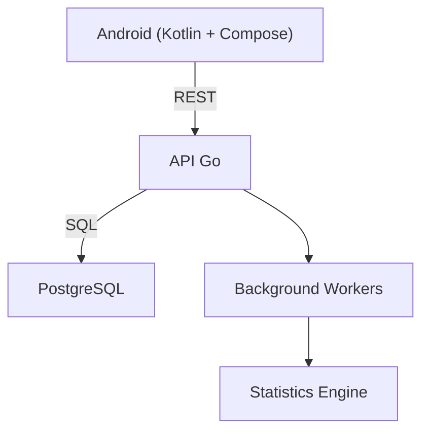
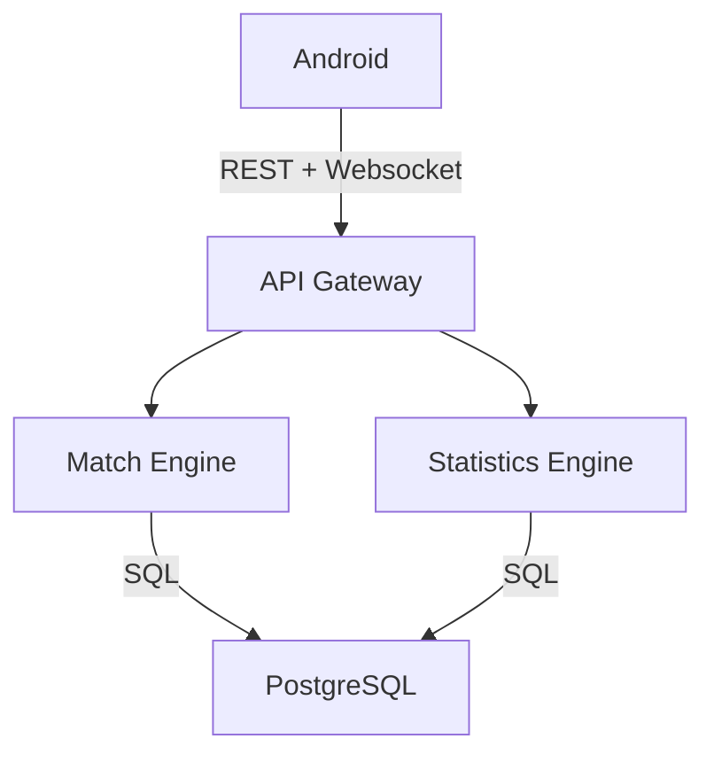

# Commander Companion
## Roadmap de desarrollo

**Versión:** 0.1

> Seguimiento de tareas: ver [TASKS.md](TASKS.md) para el checklist detallado y actualizado del estado real de cada etapa.

**Objetivo**

Crear la aplicación definitiva para Commander (MTG), enfocada en:

- Rapidez durante la partida.
- Excelente UX.
- Estadísticas avanzadas.
- Sincronización entre jugadores.
- Historial de partidas.
- Integración con Moxfield.
- Arquitectura escalable.

---

# Filosofía del proyecto

La prioridad NO es tener cientos de funcionalidades.
La prioridad es que cualquier acción pueda hacerse en menos de dos segundos.

Todo el diseño gira alrededor de tres pilares:

- Simplicidad
- Velocidad
- Datos

---

# Arquitectura general

En fases posteriores:

Inicialmente será un **Monolito Modular**.
No habrá microservicios.

---

# Etapas

## Stage 0: Definición funcional
- Definir exactamente qué hará el MVP.
- Entregables: Casos de uso, Wireframes, Arquitectura, Modelo de datos, API.

## Stage 1: Backend
- Proyecto Go. Disponer de una API completamente funcional.
- Entregables: `cmd/`, `internal/`, `pkg/`, `configs/`, `migrations/`, `docs/`.
- Tecnologías: Go, Gin/Fiber, PostgreSQL, sqlc, goose, Docker.
- Organización: `internal/auth/`, `users/`, `decks/`, `games/`, `statistics/`, `sync/`, `websocket/`, `common/`.
- Objetivo: Lógica en Service. DB en Repository.

## Stage 2: Base de datos
- Diseñar todo el modelo sin escribir código.
- Entregables: Diagrama ER, Migraciones, Índices, Relaciones.

## Stage 3: API
- Definir primero OpenAPI. Después implementar.

## Stage 4: Cliente Android
- Proyecto separado. Tecnologías: Kotlin, Compose, Material 3, Navigation, Hilt, Retrofit, Room, DataStore.
- Arquitectura: Clean Architecture + MVVM + UDF.

## Stage 5: Integración
- Conectar Android con Backend.

## Stage 6: Sincronización
- Websocket.

## Stage 7: Estadísticas
- Motor independiente.

## Stage 8: Importación Moxfield
- Sincronización.

---

# Definición de la API

- REST, Stateless, JWT, Versionada (/api/v1).
- OpenAPI 3.1
- DTOs independientes
- Paginación cursor-based

Módulos principales:
- `/auth`
- `/users`
- `/decks`
- `/games`
- `/game-actions`
- `/statistics`
- `/sync`

---

# Fuentes de verdad
Se usarán cuatro fuentes de verdad para facilitar el entendimiento y el desarrollo en paralelo (especialmente con IA):
1. **DBML**: Esquema y relaciones de la BD.
2. **OpenAPI 3.1**: Contrato único entre backend y cliente Android.
3. **Mermaid**: Arquitectura, flujos y diagramas de comportamiento.
4. **ADR (Architecture Decision Records)**: Registro de todas las decisiones técnicas importantes.
