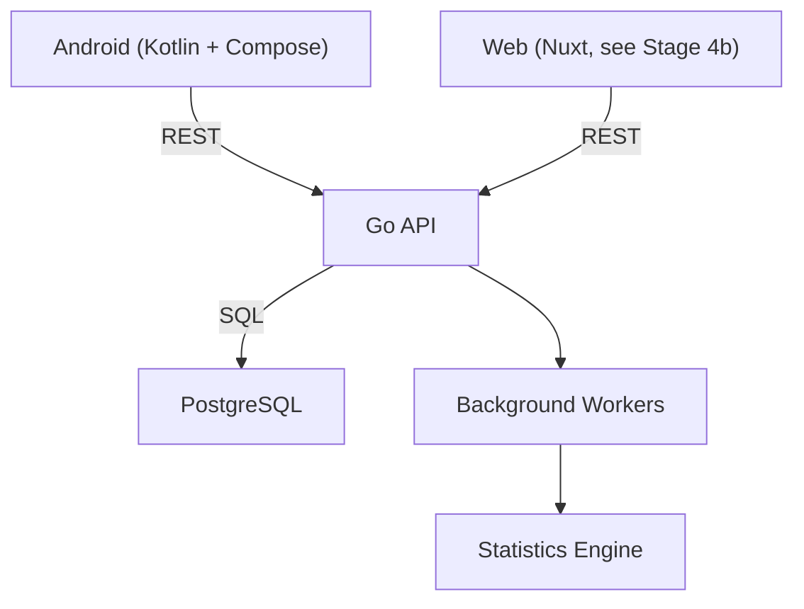
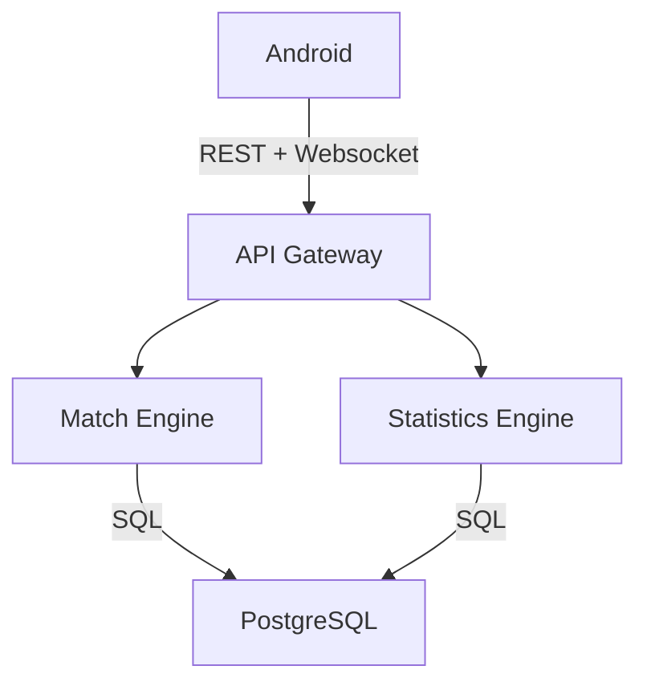

# Commander Companion
## Development roadmap

**Version:** 0.1

> Task tracking: see [TASKS.md](TASKS.md) for the detailed, up-to-date checklist of each stage's real status.

**Goal**

Build the definitive app for Commander (MTG), focused on:

- Speed during the game.
- Excellent UX.
- Advanced statistics.
- Sync between players.
- Game history.
- Moxfield integration.
- Scalable architecture.

---

# Project philosophy

The priority is NOT to have hundreds of features.
The priority is that any action can be done in under two seconds.

The whole design revolves around three pillars:

- Simplicity
- Speed
- Data

---

# General architecture

Note: the Web client wasn't in the original roadmap — it was added later
(see Stage 4b). "Background Workers"/"Statistics Engine" were the original
aspiration; today statistics are recalculated in-process within the same
monolith (`internal/statistics`), not as a separate worker — see
[ADR-0010](../decisions/0010-monolito-modular-vs-microservicios.md).

In later phases:

It will initially be a **Modular Monolith**.
There will be no microservices.

---

# Stages

## Stage 0: Functional definition
- Define exactly what the MVP will do.
- Deliverables: Use cases, Wireframes, Architecture, Data model, API.

## Stage 1: Backend
- Go project. Have a fully functional API.
- Deliverables: `cmd/`, `internal/`, `pkg/`, `configs/`, `migrations/`, `docs/`.
- Technologies: Go, Gin/Fiber, PostgreSQL, sqlc, goose, Docker.
- Organization: `internal/auth/`, `users/`, `decks/`, `games/`, `statistics/`, `sync/`, `websocket/`, `common/`.
- Goal: Logic in Service. DB in Repository.

## Stage 2: Database
- Design the whole model without writing code.
- Deliverables: ER Diagram, Migrations, Indexes, Relationships.

## Stage 3: API
- Define OpenAPI first. Implement afterward.

## Stage 4: Android Client
- Separate project. Technologies: Kotlin, Compose, Material 3, Navigation, Hilt, Retrofit, Room, DataStore.
- Architecture: Clean Architecture + MVVM + UDF.

## Stage 4b: Web Client (Nuxt)
- Not in the original roadmap (added 2026-07-26, see [ADR-0004](../decisions/0004-web-client-nuxt.md)): a second, decoupled client using the same REST contract as Android. Covers Moxfield import and statistics — use cases that are more comfortable on desktop than in the mobile life tracker.
- Technologies: Nuxt 4 (SSR), Tailwind CSS, npm.

## Stage 5: Integration
- Connect Android with Backend.

## Stage 6: Synchronization
- Websocket.

## Stage 7: Statistics
- Independent engine.

## Stage 8: Moxfield Import
- Synchronization.

## Stage 9: Social — friends, groups, and tournaments
- Not in the original roadmap (added 2026-07-27, to be defined in detail). A friends system (beyond the `playgroups` already implemented in Stage 1), and creating tournaments among friends, among groups, or open to strangers who sign up.

---

# API definition

- REST, Stateless, JWT, Versioned (/api/v1).
- OpenAPI 3.1
- Independent DTOs
- Cursor-based pagination

Main modules:
- `/auth`
- `/users`
- `/decks`
- `/games`
- `/game-actions`
- `/playgroups`
- `/statistics`
- `/sync`

---

# Deployment infrastructure

Not in the original roadmap (added 2026-07-27). **Decision closed 2026-07-30**: [ADR-0015](../decisions/0015-infraestructura-de-despliegue.md) — backend on Render, frontend on Vercel, database on Supabase (under Option 1 below). The backend already has real preparation for this (goose migrations embedded at startup, specifically designed for Render's free tier; `backend/README.md` documents the env vars — see [TASKS.md](TASKS.md), "Infra / configuration" section of Stage 1). There's still no `render.yaml`/IaC or a CI workflow that deploys (both platforms are configured manually via dashboard, see the ADR).

### Option 1: Modern PaaS / Serverless (chosen)
- **Frontend:** Vercel (decided) or Cloudflare Pages (static deployment, global CDN, automatic GitOps).
- **Backend:** Render (decided) or Fly.io (deployment via Docker container or native Go binary, initial free tier).
- **Database:** Supabase (decided) or Neon (managed serverless PostgreSQL).
- **Advantages:** Immediate deployment, zero infrastructure maintenance, generous free tier.

---

# Sources of truth
See [docs/architecture/ARCHITECTURE.md](../architecture/ARCHITECTURE.md) §"The 4 Sources of Truth" (DBML, OpenAPI 3.1, Mermaid, ADR).
